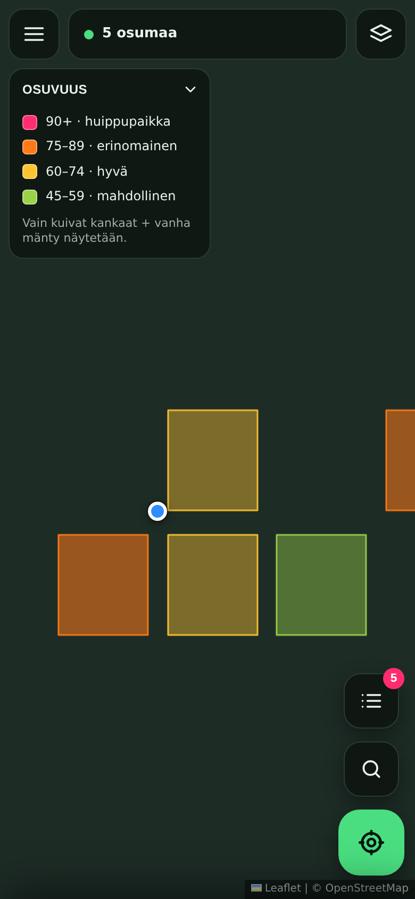
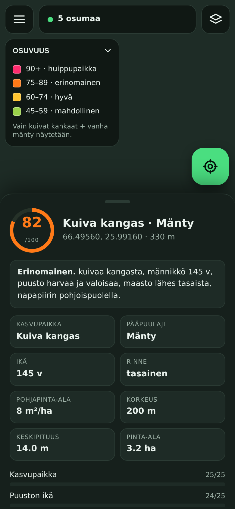
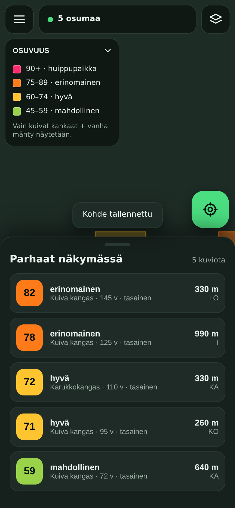

# Matsutake Go

A mobile web map for finding **tuoksuvalmuska** (*Tricholoma matsutake*) habitat in Finland.
It draws a colour-coded habitat layer over the map — like Mustikka Go's berry forecast — with
your GPS dot on top, so you can walk straight at the promising ground.

No install, no build step, no account. Open the page on your phone and add it to the home
screen; it runs offline as a PWA once loaded.

<p align="center">
  
  
  
</p>

*(Screenshots are from the automated test run, so the base map tiles and terrain are stubbed —
on a real phone you get the actual map underneath.)*

## What it looks for

Matsutake fruits in dry, lichen-rich pine heath under old Scots pine, very often on the
sloping shoulder of an esker, a road cut or a bank, and it gets commoner towards the north.
The app turns that into a score out of 100:

| Component | Weight | What it uses |
|---|---:|---|
| **Kasvupaikka** — site type | 25 | Hard requirement: `kuiva kangas` (CT). `Karukkokangas` (ClT) scores nearly as high; `kuivahko kangas` (VT) is optional and off by default. |
| **Puuston ikä** — stand age | 25 | Minimum 60 years (adjustable), climbing well past 100. |
| **Jäkälä / valoisuus** | 15 | No direct lichen attribute exists, so it is proxied: barren heath is lichen-dominated by definition, and on dry heath a low basal area means an open, light-flooded floor. Coarse sandy or gravelly soil adds a little. |
| **Rinne** — slope | 15 | Computed from an elevation model. Sweet spot 3–14°. |
| **Ilmansuunta** — aspect | 5 | Warm southern shoulders fruit first and hardest. |
| **Pohjoisuus** | 15 | Rises steadily from 60 °N to 69 °N. |

Stands that fail the hard gates — wrong site type, too young, spruce-dominated — are not
drawn at all. Everything shown is already `kuiva kangas` (or the types you enabled) with old
pine on it. Tap any polygon to see the full breakdown, every raw attribute from the source
data, and which parts of the score were estimated rather than measured.

The model is a desk estimate from map data. It narrows thousands of hectares down to a
handful of stands worth walking; it does not know whether the mushroom is actually there.

## Features

- **GPS dot** with accuracy circle, heading cone and a follow-me lock that releases the
  moment you drag the map.
- **Habitat layer** fetched live for whatever you are looking at, scored and coloured.
- **Best in view** list, sorted by score, with distance and bearing from your position.
- **Saved spots** kept on the device, exportable as **GPX** for a handheld GPS.
- **Base maps**: OpenStreetMap, OpenTopoMap (contours — useful for reading slope by eye),
  and Esri aerial imagery. Open lichen heath is strikingly pale on aerial photos, which makes
  the imagery layer a good second opinion on any stand.
- Optional **Maanmittauslaitos** maastokartta and ortokuva if you paste in a free
  [MML API key](https://www.maanmittauslaitos.fi/rajapinnat/api-avaimen-ohje).
- **Finnish and English**, Finnish by default.
- **Offline**: the app shell and every map tile you have already looked at are cached, so the
  map keeps working where the signal does not. Stand queries are never cached — stale forest
  data would be misleading.

## Data sources

| What | Source | Note |
|---|---|---|
| Forest stands | [Suomen metsäkeskus, avoin metsävaratieto](https://www.metsakeskus.fi/fi/avoimet-metsa-ja-luontotiedot) (WFS) | Licensed CC BY 4.0 |
| Elevation (slope, aspect) | [AWS Open Data Terrarium tiles](https://registry.opendata.aws/terrain-tiles/) | Global, includes the Finnish national elevation model |
| Base maps | OpenStreetMap, OpenTopoMap, Esri, optionally MML | |

### Two limitations worth knowing before you drive somewhere

**The Forest Centre data covers privately owned forest.** Large state holdings managed by
Metsähallitus are largely absent — and in Lapland, exactly where matsutake is best, a great
deal of the forest is state land. Blank map does not mean bad ground. On those areas, switch
to the aerial base map and read the terrain yourself: pale, open, lichen-floored pine on a
south-facing esker flank is the thing you are looking for.

**The endpoint could not be verified from the machine that built this.** The build
environment had no outbound network access, so the default WFS URL and layer name
(`stands:stand`) come from documentation, not from a live call. If nothing loads, open
**Valikko → Aineistolähde → Testaa yhteys**: it reads `GetCapabilities`, lists the layers the
service actually publishes, and picks a plausible one for you. The endpoint, layer and an
optional CORS proxy are all editable there. Everything else — request building, axis-order
probing, attribute normalisation, scoring, terrain — is covered by the test suite.

The client is deliberately forgiving about the source: attribute names are matched
case-insensitively against a table of aliases (`fertilityclass`, `FertilityClass`,
`kasvupaikka`, …), and if the service answers an EPSG:4326 bbox in lat/lon order it detects
that and retries, then remembers which order worked.

## Running it

Any static file host will do — it is plain HTML, CSS and ES modules with Leaflet vendored
into `vendor/`. There is nothing to compile.

```bash
npm start            # serve at http://localhost:8080
```

Geolocation needs a secure context, so on a phone serve it over **HTTPS** (or `localhost`).

### GitHub Pages

Settings → Pages → deploy from branch, root of the repository. The app is at the repo URL.

## Tests

```bash
npm test             # 35 unit tests: scoring, attribute parsing, WFS probing, slope maths
npm run test:e2e     # browser run against a stubbed WFS; writes test/screenshots/
```

The slope and aspect tests check the terrain maths against synthetic planes with known
gradients — a sign error there would quietly point every user at the shady north side of
every esker. The end-to-end test drives the real UI in a mobile-sized Chromium and fails on
any console error.

## Picking, in practice

Season runs from late August into October, best around September. Everyman's rights cover
picking mushrooms on other people's land, but not in nature reserves with restrictions, and
not in yards or cultivated areas. Tuoksuvalmuska has lookalikes — most importantly the
poisonous *Tricholoma* species and other pale valmuskat — so identify by the distinctive
spicy-cinnamon smell and the ring on the stem, and never eat anything you are not sure of.

## Licence

MIT. Map and forest data belong to their respective providers under their own terms.
