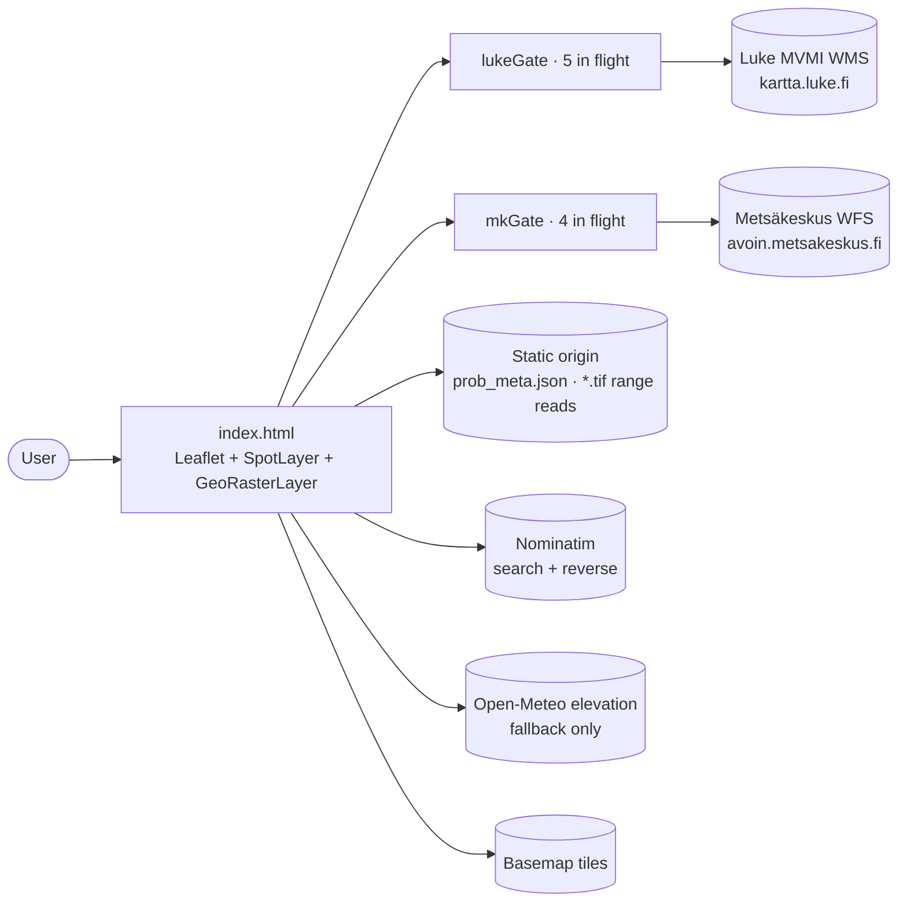
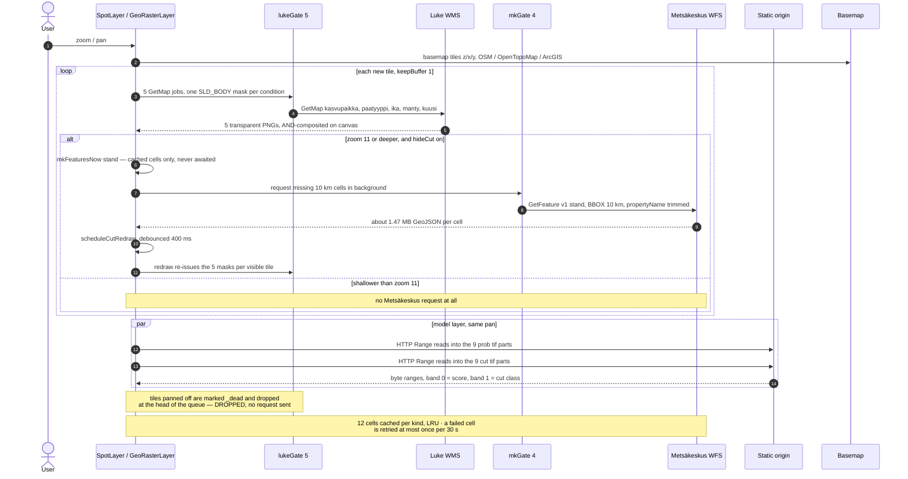
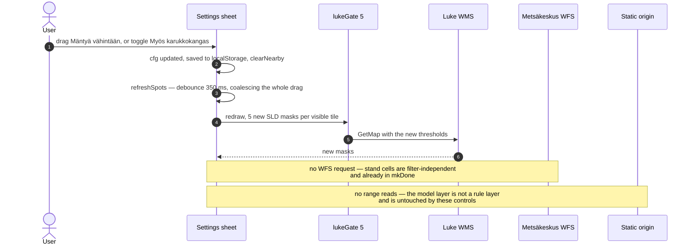
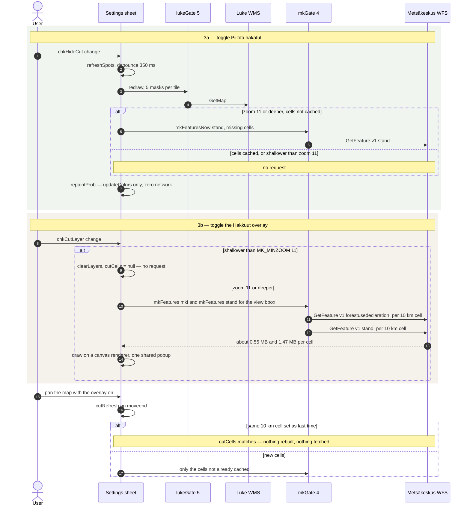
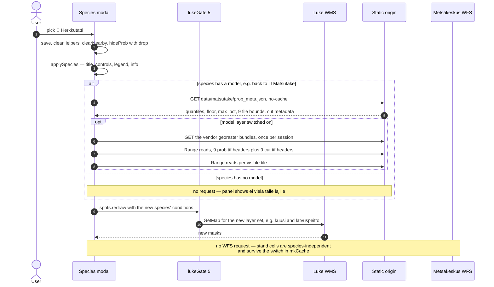
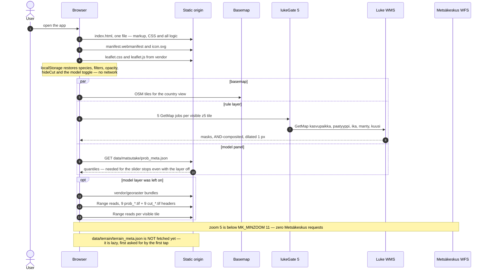
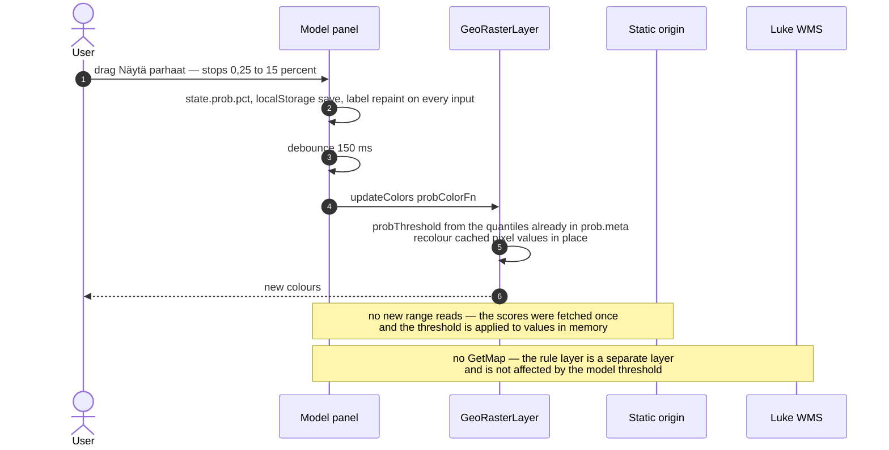
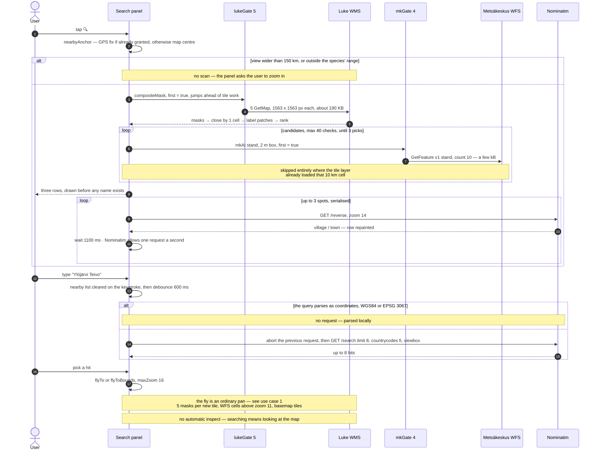
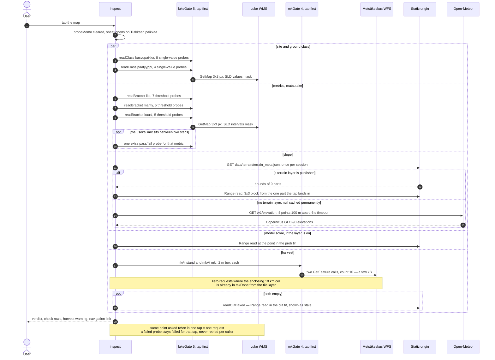
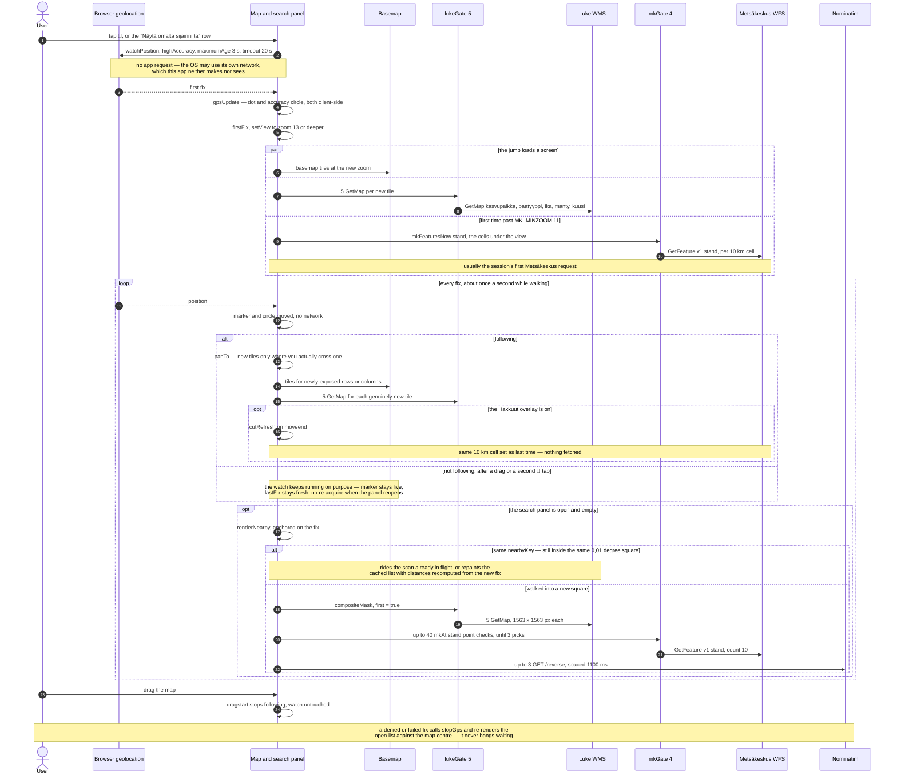

# Network requests, per use case

What actually leaves the browser for nine common interactions. Everything here is read from
`index.html` — request counts, queue limits, debounces and zoom floors are the constants in that
file, named so they can be checked against it.

## Services

| Participant | Host | What is asked for |
|---|---|---|
| **Luke** | `kartta.luke.fi/geoserver/MVMI/wms` | `GetMap` PNG, one per condition, styled server-side with `SLD_BODY` so the answer is a 1-bit mask. Shared queue `lukeGate`, **5** in flight (`LUKE_PAR`, one under GeoServer's `x-concurrent-limit-user: 6`). |
| **MK** | `avoin.metsakeskus.fi/rajapinnat/v1/ows` | WFS `GetFeature` GeoJSON, `v1:stand` and `v1:forestusedeclaration`. Shared queue `mkGate`, **4** in flight (`MK_PAR`), 9 s timeout, only at zoom ≥ **11** (`MK_MINZOOM`). |
| **Static** | same origin (GitHub Pages) | `prob_meta.json`, `terrain_meta.json`, the vendored georaster scripts, and HTTP **range** requests into the 9+9 GeoTIFF parts under `data/matsutake/`. |
| **Nominatim** | `nominatim.openstreetmap.org` | `/search` for the box, `/reverse` for the names in "lähellä sinua". One request a second, never per keystroke. |
| **Open-Meteo** | `api.open-meteo.com/v1/elevation` | Slope, **fallback only** — used when no baked terrain layer is published. |
| **Basemap** | OSM / OpenTopoMap / ArcGIS | Ordinary raster tiles. |

Two properties hold across every diagram below:

- **One queue per service, shared by every call site.** Tiles, taps and the nearby scan all go
  through the same `gate`, so the number of open connections is a property of the app and not of
  whichever feature happens to be running.
- **A tap or a scan jumps the line** (`{first: true}`), and **a tile panned off screen is never
  requested at all** — `run` drops it with `DROPPED` at the head of the queue instead of spending
  a slot on an image nobody will see.

---

## 1. Zoom and pan the matsutake map, model layer on

Per **new** tile: 5 Luke masks (`kasvupaikka`, `paatyyppi`, `ika`, `manty`, `kuusi` at matsutake's
defaults) plus range reads into the model raster. Metsäkeskus is fetched by **10 km cell**, not by
tile, so one WFS response serves many tiles and panning inside the same cells is free. The tile is
drawn with whatever harvest data is already in hand and handed back immediately — it never waits on
the ~1.5 MB cell download.

**Costs:** 5 Luke requests per new tile. 1 WFS request per newly entered 10 km cell (≈ 1.47 MB),
capped at 12 cells per kind. Zero Metsäkeskus traffic below zoom 11. A landing cell costs one extra
debounced redraw of the visible tiles.

---

## 2. Change a forest setting (ikä, mäntyä, kuivahko, karukko, vähäkuusiset)

Every filter control funnels through `refreshSpots()`: clear the nearby list, then one debounced
`spots.redraw()`. Dragging a slider therefore costs **one** redraw, not one per input event. The
masks change, so all of them are re-fetched; the Metsäkeskus cells do not depend on the filter and
come straight from cache.

**Costs:** 5 Luke requests × visible tiles, once per 350 ms of settling. Everything else: zero.
(The opacity slider is pure canvas — **no** requests at all.)

---

## 3. Change a hakkuu setting

Two different controls, two different shapes.

**3a — "Piilota hakatut" (`chkHideCut`)** subtracts cut stands from the rule mask and recolours the
model layer's second band. The recolour is in-memory; the mask redraw is the same debounced path as
use case 2.

**3b — "Hakkuut" overlay (`chkCutLayer`)** draws the polygons themselves, so it needs **both**
datasets — stands *and* declarations — for the whole view.

**Costs:** 3a is a mask redraw and an in-memory recolour. 3b is up to 2 WFS requests per 10 km cell
in view, then nothing at all while panning inside the same cells.

---

## 4. Change the mushroom

The species picker drops the model layer entirely (`hideProb(true)` releases the rasters), rebuilds
the controls, and redraws with a different set of layers and SLDs. `renderProb()` always asks for
the species' `prob_meta.json` — matsutake is the only species with a model, so for the other four
this is a UI note and **no** request.

**Costs:** 4–5 Luke requests per visible tile. One `prob_meta.json` when switching *to* matsutake.
The 9+9 raster headers only if the model layer is on. Metsäkeskus: nothing.

---

## 5. Open the app — Finland overview at zoom 5

Cold start at `setView([65.4, 26.5], 5)`. Zoom 5 is below `MK_MINZOOM`, so Metsäkeskus is never
touched: at that scale a 10 km cell is a few pixels and enumerating the cells of one z5 tile would
mean thousands of requests.

**Costs:** the static bundle, basemap tiles, 5 Luke requests per visible tile, one
`prob_meta.json`. No Metsäkeskus, no terrain, no geocoder.

---

## 6. Change the matsutake "best %" slider

The rasters already hold every score; the slider only moves the threshold the colour function
compares against. So this is a **pure client-side repaint** — the one interaction in the app that
touches the network not at all.

**Costs:** zero requests.

---

## 7. Search for a place

Opening the 🔍 panel does two unrelated things. The **nearby scan** runs immediately and is by far
the most expensive single action in the app: five *full-size* Luke reads, 1563 × 1563 px each
(≈ 190 KB), covering a 50 km box. Typing is what talks to Nominatim, and only after a 600 ms
debounce — its usage policy forbids per-keystroke autocomplete.

**Costs:** 5 large Luke reads per scan, up to 40 tiny WFS point queries, up to 3 Nominatim reverse
lookups spaced 1.1 s. One `/search` per 600 ms of settled typing. A scan re-runs on pan only after
the view has moved 5 km (`NEARBY_REANCHOR_M`).

---

## 8. Tap a forest for info

The heaviest *burst*, and deliberately so: every probe is a 3 × 3 px `GetMap` that costs the server
almost nothing, they all jump the queue ahead of tile work, and the same question about the same
point is asked exactly once per tap (`probeMemo`, dropped when the next tap starts).

For matsutake: 8 site-class probes + 4 ground-type probes + 7 age steps + 5 pine steps + 5 spruce
steps ≈ **29 probes**, plus at most one extra per metric when the user's own limit falls strictly
between two fixed steps — every other case is already settled by the bracket that was paid for.

**Costs:** ≈ 29–32 tiny Luke probes, 0–2 tiny WFS queries, 1 static metadata fetch (once per
session) plus a range read — or exactly one Open-Meteo request where no terrain layer is published.

---

## 9. Press 📍 and walk with the map following

The GPS itself costs the app nothing: `watchPosition` is a browser API, and whatever network
geolocation the OS does behind it is not a request this app makes or can see. Everything below is
what the *fixes* set off.

Two things carry the cost. The **first** fix is a `setView` to at least zoom 13 — from the country
view that is a whole screen of new tiles, and because 13 is past `MK_MINZOOM`, it is usually the
moment the session makes its first Metsäkeskus request at all. **Every** fix after that repaints an
open, empty search panel, and the watch fires about once a second.

That repaint is the trap the scan keying exists to close. A scan is identified by the place it is
scanning — `state.species | cfg | lat.toFixed(2) | lon.toFixed(2) | radius` — never by the repaint
counter, so ticks that land on the same cell of that grid — 0,01° is about 1,1 km north-south
and 0,5 km east-west at 63° N — ride the scan already in flight. Keyed on the
counter instead, a phone with a live fix started a fresh 5-read scan every second and the list sat
on "Etsitään…" for as long as the panel stayed open.

**Costs:** the first fix is the expensive one — a full screen of tiles at zoom 13 plus the first
WFS cells. After that, walking costs 5 Luke requests per tile you actually cross into, and the
once-a-second repaint costs **nothing** unless you leave the 0,01° square the current scan was
keyed to.
