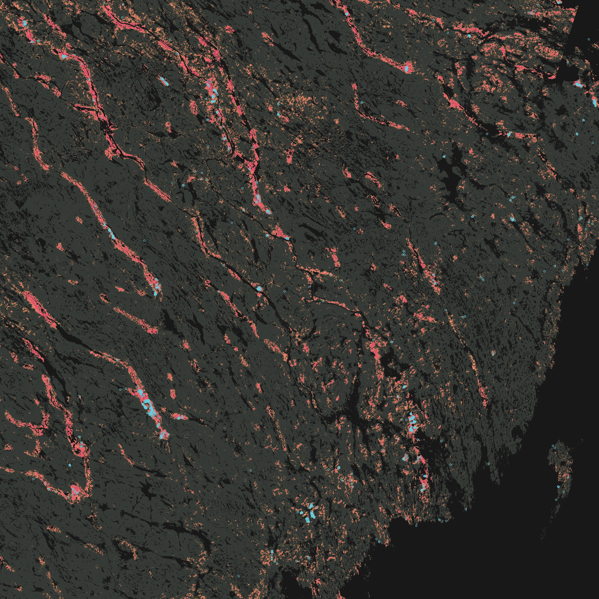
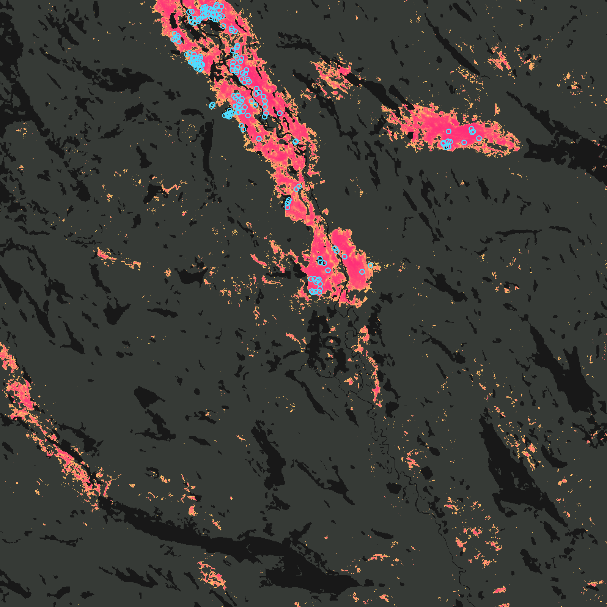
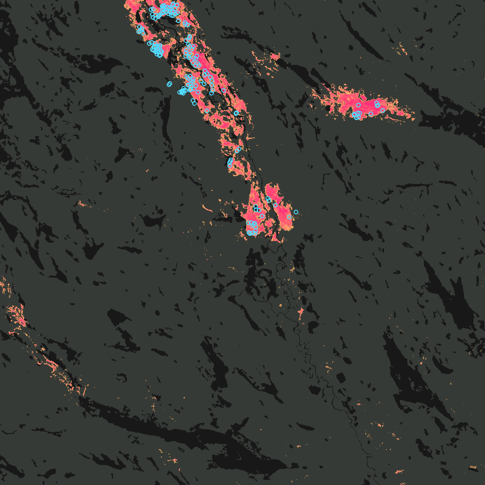

# Sweden — open forest data for training (comparison to Finland)

Sweden's matsutake range extends into the far north (Norrbotten), and finds are turning up there
in growing numbers. This started as a source audit against Finland's `ml/` pipeline and turned
into a working first cut: `ml/core/grid_se.py` and four `ml/ingest/fetch_*_se.py`-style scripts
now exist and have each been run against real data (see "What's actually been run" below). This
document is both the audit and the record of what was verified while building it.

## Source-by-source match

| Role in the FI pipeline | Finnish source | Swedish equivalent | Producer | Resolution / CRS | Licence | Access |
|---|---|---|---|---|---|---|
| Forest structure (volumes, height, diameter, basal area, biomass) | Monilähteinen VMI (MVMI), 16 m | **SLU forest map** (Skogliga grunddata), 2015 "leaf" set | SLU + Skogsstyrelsen, from Lantmäteriet laser scanning + Riksskogstaxeringen field plots | 12.5 m, SWEREF99 TM (EPSG:3006) | Open data | **Plain static GeoTIFFs on `gis.slu.se`, no login** — `/vsicurl/` works exactly like Paituli does for MVMI. Confirmed live: `ml/core/grid_se.py` reads the real header (52400×97400 px, 12.5 m, EPSG:3006) over the network. The *Skogsstyrelsen*-branded WMS/REST wrapper around the same data does need an account — irrelevant here since the ingest scripts never touch it |
| Species share of volume | manty/kuusi/koivu volumes | SLU forest map, 2018 "andel" set: pine/spruce/birch/oak/beech/contorta/other-deciduous | SLU + Skogsstyrelsen | 12.5 m | Open data | Same server, same access, confirmed via directory listing |
| Stand age | age (all MVMI cycles) | SLU forest map, 2010 vintage only | SLU + Skogsstyrelsen | 25 m, **RT90 2.5 gon V (EPSG:3021)**, not SWEREF99 | Open data | Confirmed present at `2010/Data/Raster/Rt90/AGE_XX_P_10.tif`; needs reprojecting before use, and is ~15 years stale — no newer age raster is published alongside the 2015/2018 sets |
| Elevation / slope / aspect | MML 10 m DEM | Lantmäteriet höjddata, grid 1 m | Lantmäteriet | 1 m | CC0 | `opendata.lantmateriet.se` — free account required (not yet obtained; nothing built against it yet) |
| Soil | GTK Maaperä 1:200 000 | **SGU Jordarter** | SGU | 1:25 000–1:100 000 (3.4 GB zip) or 1:1 000 000 (15 MB zip) | Open data (SGU's WMS states `Fees: NONE`, `AccessConstraints: NONE`) | Direct GeoPackage-in-zip download, no login: `resource.sgu.se/data/oppnadata/...` |
| Stand reality-check (remove clear-cuts) | Metsäkeskus metsävarakuviot | **Utförda avverkningar** (`sksUtfordAvverk`) | Skogsstyrelsen | vector, GeoPackage, 2.7 GB zip | Open data | Direct download, no login: `geodpags.skogsstyrelsen.se/geodataport/data/` |
| Declared-but-not-cut (tap-only info) | Metsäkeskus metsänkäyttöilmoitukset | **Avverkningsanmälan** (`sksAvverkAnm`) | Skogsstyrelsen | vector, GeoPackage, 67 MB zip | Open data | Same portal |
| Climate normals | FMI gridded 10 km | **SMHI PTHBV** | SMHI | ~4 km, point/multipoint query only (no bulk grid file) | CC BY 4.0 SE | `opendata-download-metanalys.smhi.se` — public JSON API |
| Training presences | GBIF + FinBIF (laji.fi) | GBIF, fed by Artportalen | GBIF.org | point | Mixed CC0 / CC BY-NC | GBIF occurrence API |

## What's actually been run

- **`ml/core/grid_se.py`** — read live against `gis.slu.se`. Confirmed: SWEREF99 TM (EPSG:3006),
  12.5 m cells, 52400 × 97400 px, bounds (267500, 6132500)–(922500, 7350000).
- **`ml/ingest/fetch_observations_se.py`** — run to completion against the live GBIF API.
  **5501** georeferenced Swedish *Tricholoma matsutake* records (vs Finland's 445), 5215 of them
  at ≤250 m coordinate uncertainty, none dropped on licence. That count needs a large caveat,
  though: **only 33 of the 5501 (0.6 %) carry a validated identification** — the rest are
  `identificationVerificationStatus=Unvalidated` citizen sightings straight from Artportalen, not
  expert-reviewed museum/collection records the way most of the Finnish set is. The sample is also
  almost entirely recent: of the first 300 records fetched, 299 were logged in 2024–2026 — this
  really does look like the recent wave the map is being built to catch, not a hundred years of
  steady reporting the way Finland's set reads. The new `verification_status` column exists so
  training can weight or filter on it rather than pooling both kinds of record at face value.
  Output: `ml/data/matsutake_se/observations.csv` (committed).
- **`ml/ingest/fetch_sgu.py`** — both resolutions, and all three fine-product layers, have now
  been downloaded and verified in full. Coarse (1:1 000 000, 15 MB): layer `grundlager`, code
  field `jg2` (int), name field `jg2_tx`, 45121 polygons, EPSG:3006 already (no reprojection
  needed, unlike GTK's WFS for Finland) — ran end-to-end, rasterized cleanly. Fine
  (1:25 000–1:100 000, 3.4 GB zip / 8.7 GB gpkg) ships three layers:
  - `grundlager` — the same fields carry over exactly as guessed, but this is
    **2 956 837 polygons**, 65× the coarse product. Its rasterize was **not** run to completion:
    the coarse run alone took over 10 minutes for 45121 polygons in the current block-by-block
    Python STRtree+rasterize approach, so 2.96 M polygons at the same rate would be impractically
    slow — needs per-region tiling or a native rasterizer (`gdal_rasterize` isn't installed in
    this environment) before it's usable at full resolution.
  - `ytlager` (`jy1`/`jy1_tx`) — **411 549 polygons**, 26 classes, dominated by Morän (220k), Torv
    (84k), Oklassad jordart (58k), Svallsediment grus-block (14k), Lera-silt (13k), Isälvssediment
    (10k), Postglacial sand-grus (8k). This is the surface layer *where it differs from
    grundlager* — coverage is partial by design (0 = no override, read grundlager for that cell
    instead), not a data gap. Small enough to rasterize in full: ran end-to-end in ~2 minutes
    (255.7M of 5.1B cells covered) and is the more ecologically relevant layer for matsutake's dry
    sandy/lichen-ground preference, since it's the actual surface a mycelium sits in rather than
    the parent material below it.
  - `oversta_ytlager` (`jy0`/`jy0_tx`) — turned out to be a near-empty niche layer once sampled:
    only **2242 polygons nationally**, and only **2 classes** (89 "Svallsediment, grus--block" —
    wave-washed gravel/boulder — and 75 "Torv" — peat). Rasterized in 4 seconds, but too sparse to
    be a general-purpose feature; kept as a documented dead end rather than wired into training.
- **`ml/ingest/fetch_skogsstyrelsen_harvests.py`** — both halves have now been run end-to-end
  against full local copies. Declared-felling (`sksAvverkAnm_gpkg.zip`, 67 MB): layer
  `AvverkningsAnmalanYta`, 129176 features, EPSG:3006. **`Avverktyp` is the felling-type field to
  filter on, not `Andamal`** — that was the first guess and it's wrong: `Andamal` is 92 %
  `"Uppgift saknas"` (no data), a purpose/land-use field, not a felling-type one.
  `Avverktyp='Föryngringsavverkning'` (regeneration felling) matched 120102 of 129176 records and
  rasterized in 20 seconds. Completed-felling (`sksUtfordAvverk_gpkg.zip`, 2.7 GB zip / 7.5 GB
  gpkg): layer is `UtfordAvverkningYta` (not the guessed `UtfordAvverkYta`), 1381787 features. The
  field guess carried over correctly this time — same `Avverktyp='Föryngringsavverkning'`, matching
  94 % of records — but the layer is built from Sentinel-2 change detection
  (`KallaDatum`='Bildanalys', `Forebild`/`Efterbild` before/after image IDs) rather than machine
  telemetry the way Finland's stand register is, and its date field is `Avvdatum`, not
  `Inkomdatum`. Full run: ~7.5 minutes to load 1343406 matching polygons, ~5 minutes to rasterize
  across 312 blocks — 12.5 minutes end to end, 279.8 million of 5.1 billion cells (5.5 %) flagged
  as completed fellings.
- **`ml/ingest/fetch_smhi_climate.py`** — run against the live API for a 40-point sample. Found
  and fixed two real API quirks while doing it: multipoint queries take **repeated `ll=` params**,
  not a semicolon-joined list (the API's own error message said so), and the server 400s without
  `Accept-Encoding: gzip`. 22 of the 40 sample points returned land data, the rest sea/border
  nulls, which the script now filters instead of crashing on. A full-country run is ~50 000
  lattice points in ~1000 batched requests — not run in full here, but every piece of the pipeline
  (lattice generation, batching, null handling, GeoTIFF writing) has been exercised against the
  real API.
- **`ml/ingest/download_slu_forestmap.sh`** — every URL in it was checked with a real HTTP
  request (directory listing or HEAD) before being written in; the files themselves (1–3.5 GB
  each, ~10 GB total) were not downloaded in full given the size.

## Where it doesn't line up

- **No direct site-fertility-class layer.** The SLU forest map gives volumes, height, diameter,
  basal area and biomass, not a soil-fertility class the way MVMI's `kasvupaikka` does. A stand-in
  would have to be engineered from SGU soil texture (sandy/esker ground for the dry, lichen-rich
  sites matsutake wants) plus low canopy cover plus pine dominance.
- **No canopy-cover layer either**, but there's a workable substitute not yet wired up:
  Naturvårdsverket's Nationella marktäckedata (NMD), CC0, 10 m, giving percent coverage in two
  height bands.
- **Age is stale and in the wrong projection** — see the table above.
- **Presence data is much larger but far less curated than Finland's.** 5501 vs 445 sounds like an
  advantage, but only 33 records have been through any identification review, and the recency
  skew (2024–2026) suggests a lot of it is the same recent public-attention wave that prompted
  this whole audit, not decades of steady collection the way the Finnish museum records are.

## What's better in Sweden

- Elevation at 1 m vs Finland's 10 m (once a Lantmäteriet account exists).
- Species-level volumes split further (contorta, oak, beech) via the 2018 "andel" set.
- The completed-felling layer is very likely all forest ownership, not just private land the way
  Metsäkeskus's kuviot are limited to: it's built from Sentinel-2 before/after image comparison
  (`KallaDatum`='Bildanalys'), which doesn't care who owns the ground the way Finland's
  machine-telemetry stand register does. No ownership field to check directly, but the detection
  method itself implies uniform coverage.
- The forest-attribute rasters need no account at all for the ingest pipeline (only the
  Skogsstyrelsen-branded live-tile WMS does), unlike what Skogsstyrelsen's own documentation pages
  suggest at first read.

## Corrections, after building the pipeline

Three conclusions in the sections above turned out to be wrong once the data was actually
read rather than inspected. They are left in place so the reasoning is visible, and corrected
here.

### The 2015 "leaf" set covers only about 73 % of Sweden

`GridSE` was derived from `VolTot_leaf.tif`, which is 52400 × 97400 at 12.5 m from
(267500, 7350000). Its top northing is 7 350 000 — roughly 66.3 °N on the central meridian,
and lower further east, because SLU clipped it to the laser coverage of the day. The ESRI
sidecar names `SLU_Skogskarta_clipMaskNOGotland.shp`, so Gotland is cut out too.

Reprojecting all 5501 observations onto it: **1508 of them, 27.4 %, fall outside** — 939 fine
presences in Lule lappmark, 271 in Torne lappmark, 216 in Norrbotten. That is the densest
matsutake ground in the country. The analysis grid is now the 2018 footprint, which covers
Sweden to 7 672 500 (≈69.2 °N), and the 2015 raster tiles into it exactly at
`Window(200, 25800, 52400, 97400)`. `ml/ingest/check_grid_se.py` asserts both, and reports
0 of 5501 outside the new grid.

### The 2010 RT90 vintage is a full national structural set, not just an age raster

The audit recorded 2010 as "the only vintage with an age raster". It also carries TOTALVOL,
PINEVOL, SPRUCEVOL, **BIRCHVOL**, DECIDUOUSVOL, CONTORTAVOL, HEIGHT, BIOMASS, OAKVOL and
BEECHVOL — 27360 × 60101 at 25 m, tiled 128×128, covering the whole country to 7 636 500.
It is the feature spine now. It costs resolution and fifteen years of currency, but it has
data where the finer set has none, and it gives birch volume separately, which the 2015 set
cannot.

The 2018 "andel" set is nationally complete but **unusable**: strip-compressed at 52 600 px
per strip, 3.5 GB per file, 24 GB for the seven, and one point read costs about a megabyte.
Only its geometry is used.

### Sweden does have a canopy-cover layer, and a main-class layer

"No direct site-fertility-class layer" is right. "No canopy-cover layer either" is not.
Naturvårdsverket's **Nationella Marktäckedata 2023** publishes, CC0, at 10 m, in SWEREF99 TM,
over plain HTTPS with no account:

| product | what it is | fills |
|---|---|---|
| `objekttackning`, 5–45 m band | canopy coverage in **percent**, binned 5/10/20/…/100 (11 values, read out of the product's own `.vat.dbf`) | `latvuspeitto` |
| `objekttackning`, 0.5–5 m band | understory coverage, same units | **no Finnish equivalent** |
| `basskikt` | 53 classes coding main type *and* dominant species: 111–118 forest on fastmark, 121–128 on vatmark, 200–224 open mire graded mager/frodig | `paatyyppi` — 121 tallskog på våtmark is räme, 122 granskog på våtmark is korpi |
| `produktivitet` | **three** classes: ej skogsmark / produktiv / improduktiv | a land class, *not* a fertility ladder |

`basskikt` 118 "temporärt ej skog på fastmark" is a free 2023 clear-cut signal that owes
nothing to Skogsstyrelsen.

`ml/ingest/fetch_nmd.py` reads each archive's ZIP64 central directory over a range request
and inflates only the members it needs (3.1 GB instead of 7.5 GB), then compacts each raster
onto the analysis grid as deflated uint8 — `basskikt` goes from 10.85 GB to 749 MB.

### How Sweden actually classifies site fertility, and why we still cannot have it

Swedish forestry uses *ståndortsbonitering* (Hägglund & Lundmark, 1981). It has no single
fertility class; it derives **ståndortsindex** from site factors a forester records on the
ground: climate, **markfuktighet** (torr/frisk/frisk-fuktig/fuktig/blöt), rörligt markvatten,
**jordart and textur**, jorddjup, **vegetationstyp**, lutning, ytstruktur.

**`vegetationstyp` is the true `kasvupaikka` analogue** — an ordered nutrient ladder used by
Riksskogstaxeringen: *lavtyp → lavrik typ → fattigristyp → kråkbär-ljungtyp → lingontyp →
blåbärstyp → smalbladig grästyp → bredbladig grästyp → lågörttyp → högörttyp*. Its dry,
lichen-rich bottom is exactly matsutake ground, and exactly what the Swedish observers write
in their own habitat notes ("lavtallskog", "tallhed").

It is not obtainable, and the reason is structural rather than an oversight:
Riksskogstaxeringen records vegetationstyp on ~12 000 plots a year and publishes the
temporary-plot data openly, **but withholds the exact plot coordinates for privacy**,
releasing them only under a signed confidentiality agreement. So neither the layer nor the
training data to reproduce it is open. Ståndortsindex is likewise not published as a national
raster. The fertility axis in `features_se.py` is therefore engineered from soil texture,
canopy cover and the mire grading, and the model report should not imply parity with Finland
on this point. If it turns out to cost real skill, the route is a data request to SLU, not
more engineering.

The best soil-moisture layer, **SLU Markfuktighetskarta** (2 m, CC0), is open but *not
reachable from this container*: it is served over `ftps://ftpsks.skogsstyrelsen.se` and via
an ArcGIS ImageServer that returned a sign-in page to an anonymous request. NMD's 10 m
markfuktighetsindex is the substitute. Worth revisiting — 2 m soil moisture would be the best
site-type layer available in either country.

### What the finds themselves say about parent material

Sampling the coarse SGU `grundlager` at the 4795 finds located to ≤25 m, against the same
raster's national land distribution:

| parent material | of finds | of land | ratio |
|---|---:|---:|---:|
| **Isälvssediment** (glaciofluvial) | 47.1 % | 6.8 % | **7.0×** |
| Postglacial sand–grus | 9.6 % | 3.6 % | 2.7× |
| Morän (till) | 29.9 % | 52.5 % | 0.6× |
| Berg (bedrock) | 8.9 % | 16.8 % | 0.5× |
| Torv (peat) | 3.1 % | 8.5 % | 0.4× |

Nearly half of Swedish matsutake sits on esker and glaciofluvial material covering under
7 % of the country. That is the "hiekkainen/harjumaaperä" factor README.md names as the most
important one still missing from the Finnish model, measured on 4795 points.

NMD produktivitet at the same points: 86.2 % on produktiv skogsmark against a 39.3 % national
baseline, and improduktiv enriched 1.5× — the hällmark and lavhed the observers describe.

## The pilot raster

`ml/export/predict.py --species matsutake_se --block 1024 --workers 3 --bbox 650000 7050000
800000 7200000` — 150 × 150 km of inland Västerbotten and Lule lappmark, the densest
matsutake ground in Sweden, chosen by sliding a 150 km window over the 5215 finely located
finds. 149 blocks at 14.1 s each, about 35 minutes on four cores.

| | |
|---|---|
| cells scored | 100.9 M of 144 M (70 %; the rest is not forestry land in the SLU 2010 model) |
| score across the box | median 31, p90 70, p98 87 |
| known finds inside | 1396, of which 1250 on scored ground |
| their scores | median **88**, quartiles 77–93 |
| top 1 % of scored land | holds 40 % of the finds |
| **top 2 %** | **56 %** |
| top 5 % | 72 % |
| top 10 % | 86 % |

The raster itself is committed at `data/matsutake_se/prob_matsutake_se_pilot_12m5.tif`
(41.5 MB COG, 12000 × 12000 at 12.5 m, EPSG:3006) with `prob_meta.json` beside it carrying
the bounds, the floor, the 101-point quantile table and the out-of-fold metrics. Scores below
the top 15 % of forestry land are stored as 0, the convention `export_app.py` uses for the
Finnish parts. 86 % of the 1396 finds in the box fall on ground the file keeps, at a median
score of 89.

**These are in-sample numbers and are not the model's score.** Those finds trained the
model; the honest figures are the out-of-fold ones in
[docs/MODEL_REPORT_matsutake_se.md](MODEL_REPORT_matsutake_se.md), where the top 2 % holds
47 % of held-out finds and 40 % of held-out kilometre cells. What the pilot establishes is
that the pipeline runs end to end at national resolution and that the raster behaves the way
the cross-validation said it would.

The 146 finds that land on unscored cells are the honest cost of using the SLU 2010 model as
the forestry-land mask: a find on a roadside, a cabin plot or a cell the k-NN model left
blank has no features to score.

### What it looks like

Coloured with `js/problayer.js`'s own ramp — yellow at the threshold running to pink at the
very best cells — over the scored ground (dark grey) and everything the SLU 2010 model does
not call forestry land (black). Cyan rings are the known finds located to 250 m or better.
`pct` is the app's slider: the share of forestry land the map covers.

*The full 150 × 150 km box at `pct = 0.05`, downscaled 8× (1 px ≈ 100 m). The Gulf of
Bothnia is the black wedge bottom-right. The scoring picks out a set of parallel
ribbons running NW–SE — glaciofluvial eskers, laid down along the ice-flow direction — and
the finds sit on them. This is the 7× isälvssediment enrichment as geometry rather than as
a table. 1396 finds are drawn; at this scale dense clusters merge.*

*The densest 20 × 20 km of the box at full 12.5 m resolution, `pct = 0.05`, holding 186
finds. One esker runs corner to corner with a second entering from the right, and the finds
track both. The thin dark lines through the coloured ground are streams and the mires beside
them, which the model scores down.*

*The same ground at `pct = 0.02` — the "few sure shots" setting. The colour retreats to the
esker crests and the finds stay with it, which is what recall@2 % measures.*

Rendered by the snippet in this section's commit; the ramp, the quantile lookup and the
threshold are read from `ml/models/matsutake_se/model.json`, so the pictures use the same
numbers the app would.

**Full-country cost**, from this measured rate: 6.48e9 cells is 6172 blocks at 1024, so
roughly 24 hours on four cores — restartable through `<out>.progress`. The output would be
1.5–2.5 GB compressed, which `export_app.py` would need to split into more than Finland's
nine parts to stay under GitHub's 100 MB file limit.

Drawing it in the app is a separate piece of work and is not done: `js/geo.js` hard-codes
the TM35FIN projection parameters that `problayer.js`, `rasterread.js` and `hillshade.js`
all use to sample a raster at a point. SWEREF99 TM is the same transverse-Mercator family
with a different central meridian, so that is a parameterisation rather than a rewrite — but
it is a change to every raster-reading path in the frontend, and the observation layer needed
none of it because it plots plain lat/lon markers.

## Next steps

Items 1, 3 and 4 are done; see the corrections above.

1. Fine-scale `grundlager` (2.96 M polygons) is still impractical for `fetch_sgu.py`'s
   per-block STRtree rasterizer. The coarse 1:1 M layer is the parent-material stand-in.
   `ml/experiments/habitat_words_se.py` is what decides whether fixing it is worth it: if the
   `hällmark` label is not predictable from `soil_rock` and `rock_frac160`, the 1:1 M layer is
   too coarse for outcrops and that is the concrete justification.
2. Register a Lantmäteriet open-data account for the 1 m elevation grid. Until then the terrain
   block is Copernicus GLO-30, which is a **surface** model — see the DSM note in
   `features_se.py` for why the short-range relief feature Finland has is dropped here.
3. Chase SLU Markfuktighetskarta (2 m) through a route that is not FTPS.
4. `verification_status`: 5395 of 5501 records are `Unvalidated` and filtering to validated
   leaves 33, so it is carried as a meta column with a `--unvalidated-weight` sensitivity run
   rather than used as a filter. No weighting scheme fixes a 99.4 % unvalidated corpus; the
   639 records that carry a human-written habitat description are the closest thing to a
   quality check, and `habitat_words_se.py` reports on them.
